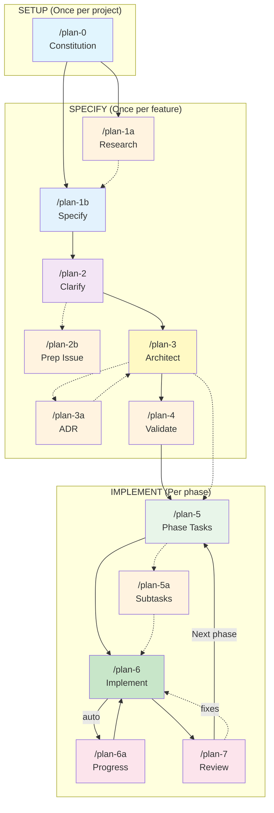
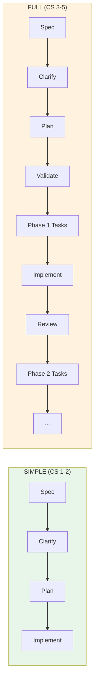

# Planning Commands: Getting Started

A quick visual guide to the `/plan-*` command workflow. For complete reference, see [README.md](./README.md).

---

## The Big Picture



**Legend**: Solid lines = main flow | Dashed lines = optional | Orange = optional commands

---

## How It Works

The planning workflow separates **what** you want to build from **how** you'll build it, ensuring you think through requirements before jumping into code.

**Start with research** (`/plan-1a`). Before writing anything, explore the existing codebase. How do similar features work? What patterns does the project use? What will your feature need to integrate with? If you're working with unfamiliar technology, use `/deepresearch` to gather external knowledge first.

**Write a technology-free spec** (`/plan-1b`). Describe the feature in plain English—what it does, why users need it, what success looks like. No implementation details yet. This forces clarity on the actual problem before solution bias creeps in.

**Clarify ambiguities** (`/plan-2`). Answer key questions: How should we test this? What's out of scope? What are the edge cases? The spec gets refined with your answers, creating a clear contract for what you're building.

**Now bring in technology** (`/plan-3`). With requirements locked down, the architect phase designs the implementation. It analyzes the codebase, identifies patterns to follow, and breaks the work into phases. Each phase has clear acceptance criteria. If major design decisions need documenting, `/plan-3a` creates an ADR.

**For each phase** (`/plan-5` → `/plan-6` → `/plan-7`). For each phase: generate detailed tasks (/5), implement them with your chosen testing approach (/6), then review (/7). Progress is tracked automatically. If something gets complex mid-phase, `/plan-5a` lets you break it down further without losing context (take a detour and then come back).

The result: traceable, well-tested code with clear documentation of why decisions were made.

---

## Example Walkthrough

### Adding an External API Integration

Imagine you need to add a weather service that fetches forecasts and displays them in the app.

**1. Research first** — You don't know how the app handles external services yet.

```bash
/plan-1a-explore "how does the app integrate with external APIs"
```

The research reveals the app uses a service layer pattern with retry logic and circuit breakers. There's an existing HTTP client wrapper you should use.

**2. Check if external research is needed** — The research flagged that you're unfamiliar with the weather API's rate limits and authentication patterns.

```bash
/deepresearch "OpenWeatherMap API best practices, rate limiting, and error handling patterns 2024"
```

**3. Write the spec** — Now you understand the landscape.

```bash
/plan-1b-specify "Add weather forecast display showing 5-day forecast for user's location, with graceful degradation when the service is unavailable"
```

**4. Clarify the details**

```bash
/plan-2-clarify
```

Questions answered: TAD testing approach, avoid mocks (use recorded responses), cache forecasts for 30 minutes, show "unavailable" message on failure.

**5. Generate the plan**

```bash
/plan-3-architect
```

Creates a 3-phase plan:
- Phase 1: Weather service client with retry logic
- Phase 2: Caching layer and error handling
- Phase 3: UI components and integration

**6. Execute each phase**

```bash
/plan-5 --phase "Phase 1: Weather Service Client" --plan "docs/plans/001-weather/weather-plan.md"
/plan-6 --phase "Phase 1: Weather Service Client" --plan "docs/plans/001-weather/weather-plan.md"
/plan-7 --phase "Phase 1: Weather Service Client" --plan "docs/plans/001-weather/weather-plan.md"
```

Repeat for phases 2 and 3. Done.

---

### Quick Bug Fix (Simple Mode)

Not everything needs the full ceremony. For a simple bug fix:

```bash
/plan-1b-specify "Fix timezone display bug where UTC times show instead of local times"
/plan-2-clarify    # Select "Simple" mode
/plan-3-architect  # Generates single-phase inline plan
/plan-6-implement-phase
```

Four commands, done.

---

## Quick Reference

| Command | What it does | Creates |
|---------|--------------|---------|
| `/plan-0` | Set project constitution, rules, idioms | `docs/project-rules/` |
| `/plan-1a` | Research existing code *(optional)* | `research-dossier.md` |
| `/plan-1b` | Write feature specification | `<slug>-spec.md` |
| `/plan-2` | Answer clarifying questions | Updates spec |
| `/plan-2b` | Generate issue tracker text *(optional)* | `issues/feature-<slug>.md` |
| `/plan-3` | Generate implementation plan | `<slug>-plan.md` |
| `/plan-3a` | Create ADR *(optional)* | `docs/adr/adr-NNNN-*.md` |
| `/plan-4` | Validate plan readiness *(optional)* | Readiness report |
| `/plan-5` | Generate tasks for one phase | `tasks/phase-N/tasks.md` |
| `/plan-5a` | Handle mid-phase complexity *(optional)* | `NNN-subtask-<slug>.md` |
| `/plan-6` | Implement the phase | Code + `execution.log.md` |
| `/plan-6a` | Update progress *(auto-called by 6)* | Updates task tables |
| `/plan-7` | Review implementation | `reviews/review.md` |

---

## Two Paths: Simple vs Full



**Simple Mode**: Small changes, single phase, inline tasks
**Full Mode**: Complex features, multiple phases, separate task dossiers per phase

---

## Command Details

### Setup Commands

#### `/plan-0-constitution`
**Run once per project.** Establishes the rules of engagement.

```bash
/plan-0-constitution
```

Creates four doctrine files:
- `constitution.md` - Guiding principles
- `rules.md` - Enforceable standards (MUST/SHOULD)
- `idioms.md` - Patterns and conventions
- `architecture.md` - System boundaries

---

### Specification Commands

#### `/plan-1a-explore` (Optional)
**Research before you specify.** Deep-dives into existing code.

```bash
# Output to console
/plan-1a-explore "how does the search service work?"

# Save to plan folder
/plan-1a-explore --plan auth-upgrade "research current auth system"
```

Uses 6 parallel subagents to explore implementation, dependencies, patterns, tests, interfaces, and documentation.

---

#### `/plan-1b-specify`
**Define WHAT and WHY.** Creates the feature specification.

```bash
/plan-1b-specify "Add OAuth2 login with Google and GitHub"
```

Creates `docs/plans/001-oauth/oauth-spec.md` with:
- Goals and Non-Goals
- Acceptance Criteria
- Risks and Open Questions

---

#### `/plan-2-clarify`
**Resolve ambiguities.** Asks up to 8 critical questions.

```bash
/plan-2-clarify
```

Key questions include:
1. **Mode**: Simple or Full workflow?
2. **Testing**: TDD, TAD, Lightweight, Manual, or Hybrid?
3. **Mocks**: Avoid, Targeted, or Liberal?
4. **Docs**: README, docs/how/, Hybrid, or None?

---

#### `/plan-3-architect`
**Create the blueprint.** Generates the implementation plan.

```bash
/plan-3-architect
```

Uses 4 parallel subagents to produce:
- 15-20+ Critical Research Findings
- Implementation Phases with tasks
- Testing strategy adapted to your choice
- Complexity scores (CS 1-5, never time estimates)

---

### Implementation Commands

#### `/plan-5-phase-tasks-and-brief`
**Generate phase tasks.** Creates detailed work breakdown.

```bash
/plan-5 --phase "Phase 1: Core Setup" --plan "docs/plans/001-oauth/oauth-plan.md"
```

Creates a task table with 9 columns:
Status | ID | Task | Type | Dependencies | Paths | Validation | Subtasks | Notes

---

#### `/plan-6-implement-phase`
**Write the code.** Executes implementation with your chosen testing approach.

```bash
/plan-6 --phase "Phase 1: Core Setup" --plan "docs/plans/001-oauth/oauth-plan.md"
```

Testing approaches:
- **TDD**: RED → GREEN → REFACTOR cycles
- **TAD**: Scratch tests → RUN repeatedly → Promote 5-10%
- **Lightweight**: Core validation only
- **Manual**: Documented verification steps
- **Hybrid**: Mix per task

Auto-calls `/plan-6a` after each task for progress tracking.

---

#### `/plan-7-code-review`
**Validate implementation.** Checks doctrine compliance and bidirectional links.

```bash
/plan-7 --phase "Phase 1: Core Setup" --plan "docs/plans/001-oauth/oauth-plan.md"
```

Verdict: **APPROVE** (proceed) or **REQUEST_CHANGES** (fix issues first)

---

## Optional Enhancement Commands

| Command | Purpose | When to use |
|---------|---------|-------------|
| `/plan-3a-adr` | Create Architectural Decision Record | Major design decisions |
| `/plan-4-complete-the-plan` | Validate plan readiness | Before complex implementations |
| `/plan-5a-subtask` | Handle mid-phase complexity | When task needs decomposition |
| `/plan-2b-prep-issue` | Generate issue tracker text | Syncing to GitHub/Jira |

---

## Utility Commands

These support the workflow but aren't part of the main sequence.

### `/didyouknow`
**Build shared understanding.** Surfaces 5 critical insights through conversation.

```bash
/didyouknow --plan "path/to/plan.md"
/didyouknow --tasks "path/to/tasks.md"
/didyouknow  # auto-detects context
```

Analyzes from 9+ perspectives: UX, system behavior, technical constraints, hidden assumptions, edge cases, performance, security, deployment, integration.

**Recommended**: Run between `/plan-5` and `/plan-6` for complex phases.

---

### `/tad`
**Test-Assisted Development guide.** Reference for the TAD testing philosophy.

```bash
/tad  # displays the TAD workflow guide
```

Key concepts:
- Scratch tests in `tests/scratch/` for exploration
- Run repeatedly (10-20+ RED→GREEN cycles)
- Promote 5-10% with full Test Doc blocks
- Delete the rest

---

### `/deepresearch`
**Structure external research.** Crafts prompts for Perplexity, ChatGPT, etc.

Use when `/plan-1a` or `/plan-3` identifies knowledge gaps that code can't answer.

---

### `/substrateresearch`
**Lightweight planning alternative.** For simpler projects needing less ceremony.

```bash
/substrateresearch "implement user preferences"
```

Positions AI as technical leader, creates phase-based plan with checklists.

---

### `/util-0-handover`
**Agent continuity.** Generates compact state for handoff to another LLM.

```bash
/util-0-handover --plan "path/to/plan.md" --format compact
```

Creates token-optimized (1400 token cap) handover document.

---

## Directory Structure

After a full workflow, your plan folder looks like:

```
docs/
├── project-rules/
│   ├── constitution.md
│   ├── rules.md
│   ├── idioms.md
│   └── architecture.md
├── adr/
│   ├── README.md
│   └── adr-0001-*.md
└── plans/
    └── 001-oauth/
        ├── oauth-spec.md
        ├── oauth-plan.md
        ├── research-dossier.md
        └── tasks/
            ├── phase-1/
            │   ├── tasks.md
            │   └── execution.log.md
            └── phase-2/
                └── ...
```

---

## Quick Start Examples

### Simple Feature (CS 1-2)

```bash
/plan-0-constitution          # Once per project
/plan-1b-specify "Add dark mode toggle"
/plan-2-clarify               # Select "Simple" mode
/plan-3-architect
/plan-6-implement-phase       # Inline tasks from plan
```

### Complex Feature (CS 3+)

```bash
/plan-0-constitution          # Once per project
/plan-1a-explore --plan oauth "research auth patterns"
/plan-1b-specify "Add OAuth2 authentication"
/plan-2-clarify               # Select "Full" mode, TAD testing
/plan-3-architect
/plan-4-complete-the-plan
# For each phase:
/plan-5 --phase "Phase 1: ..." --plan "..."
/didyouknow --tasks "..."     # Recommended
/plan-6 --phase "Phase 1: ..." --plan "..."
/plan-7 --phase "Phase 1: ..." --plan "..."
```

---

## Key Concepts

### Complexity Scoring (CS 1-5)

**Never use time estimates.** Use complexity scores instead:

| Score | Meaning | Factors |
|-------|---------|---------|
| CS-1 | Trivial | Single file, no dependencies |
| CS-2 | Small | Few files, minimal integration |
| CS-3 | Medium | Multiple components, some complexity |
| CS-4 | Large | Cross-cutting, significant integration |
| CS-5 | Epic | System-wide, high uncertainty |

---

### Bidirectional Graph

All changes are traceable through linked references:

```
Task T001 ──→ Execution Log Entry ──→ File Changes
    │                 │                    │
    └───── Footnote [^1] ─────────────────┘
```

`/plan-6a` maintains these links automatically.

---

### Testing Philosophy

| Approach | When to use | Evidence required |
|----------|-------------|-------------------|
| **Full TDD** | Well-defined requirements | RED→GREEN→REFACTOR cycles |
| **TAD** | Exploration, unclear reqs | 10-20 scratch tests, 5-10% promoted |
| **Lightweight** | Simple ops, utilities | Core validation tests |
| **Manual** | UI, visual, integration | Documented steps |
| **Hybrid** | Mixed complexity | Per-task annotation |

---

## Need More?

- **Full Reference**: [README.md](./README.md) - Complete 1000+ line guide
- **TAD Details**: Run `/tad` for the full workflow guide
- **Research**: Run `/plan-1a-explore "your question"` for codebase exploration

---

*This guide provides the essentials. The full [README.md](./README.md) contains detailed specifications, troubleshooting, and advanced usage.*
