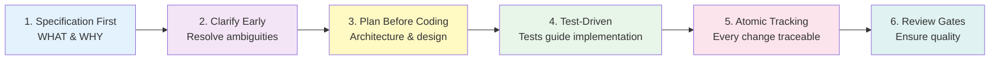
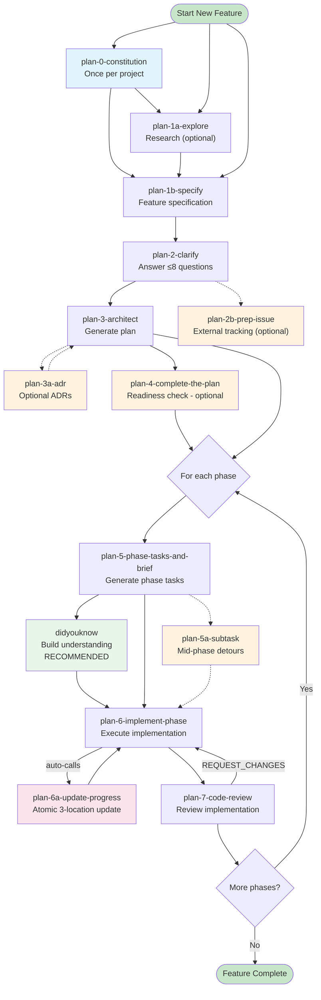
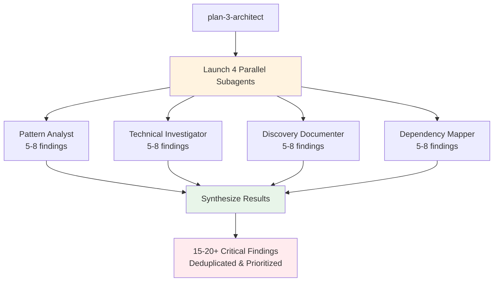
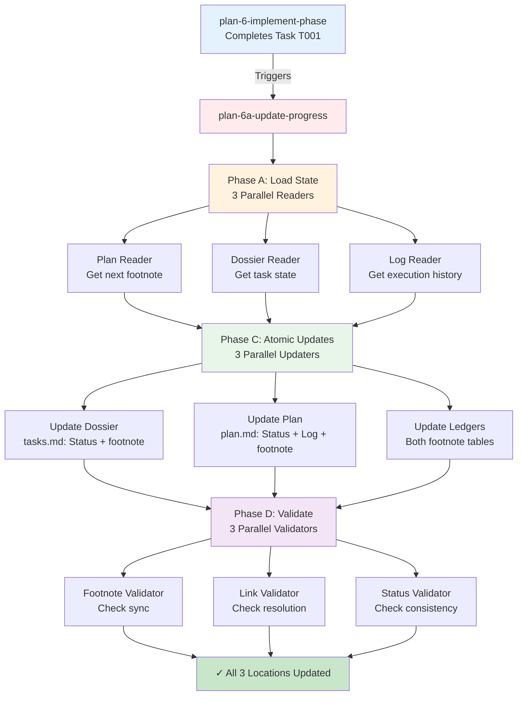
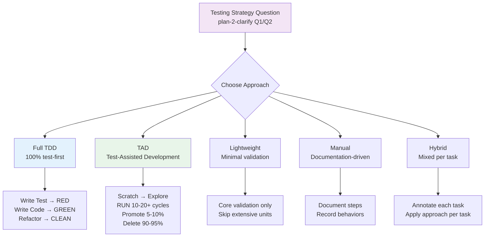
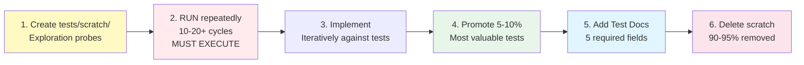
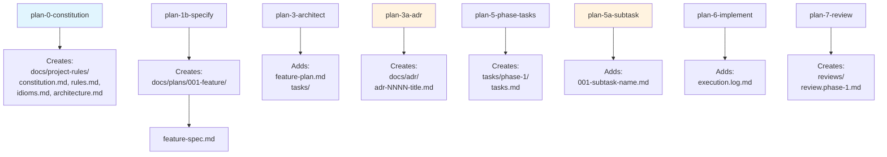
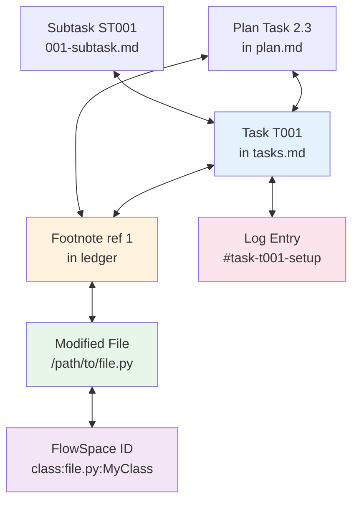

# /plan Commands Workflow Guide

A comprehensive guide to the /plan command suite for structured, phase-by-phase feature development with full traceability and quality gates.

## Table of Contents

- [Overview](#overview)
- [Quick Start](#quick-start)
- [Command Flow Diagram](#command-flow-diagram)
- [Core Workflow Commands](#core-workflow-commands)
- [Optional Enhancement Commands](#optional-enhancement-commands)
- [Complexity Scoring (CS 1-5)](#complexity-scoring-cs-1-5)
- [Testing Philosophy](#testing-philosophy)
- [Directory Structure](#directory-structure)
- [Best Practices](#best-practices)
- [Common Workflows](#common-workflows)
- [Troubleshooting](#troubleshooting)

## Overview

The /plan command suite provides a structured, phase-by-phase approach to feature development with:

- **Phase-by-Phase Execution**: One phase at a time to prevent scope creep and enable focused implementation
- **Parallel Subagent Architecture**: Multiple specialized agents work concurrently for comprehensive analysis
- **Bidirectional Graph Provenance**: Complete traceability from any task to files, logs, and back
- **Quality Gates**: Multiple checkpoints ensure alignment with specifications and standards
- **Testing Integration**: Support for TDD, TAD, Lightweight, Manual, and Hybrid testing approaches

### Core Philosophy



## Quick Start

### New Feature Workflow

```bash
# 1. (Optional) Research existing codebase
/plan-1a-explore --plan oauth "research current authentication system"

# 2. Start with feature specification
/plan-1b-specify "Add user authentication with OAuth2 support for Google and GitHub providers"

# 3. Clarify ambiguities (answer ≤8 questions)
/plan-2-clarify

# 3. Generate implementation plan
/plan-3-architect

# 4. (Optional) Document architectural decisions
/plan-3a-adr --spec "docs/plans/001-oauth/oauth-spec.md" --title "Use OAuth2 for Authentication"

# 5. Validate plan completeness
/plan-4-complete-the-plan

# 6. Generate tasks for Phase 1
/plan-5-phase-tasks-and-brief --phase "Phase 1: Core Setup" --plan "docs/plans/001-oauth/oauth-plan.md"

# 7. (Recommended) Build shared understanding
/didyouknow --tasks "docs/plans/001-oauth/tasks/phase-1/tasks.md"

# 8. Implement Phase 1
/plan-6-implement-phase --phase "Phase 1: Core Setup" --plan "docs/plans/001-oauth/oauth-plan.md"

# 9. Review implementation
/plan-7-code-review --phase "Phase 1: Core Setup" --plan "docs/plans/001-oauth/oauth-plan.md"

# 10. Repeat steps 6-9 for each phase
```

## Command Flow Diagram



## Core Workflow Commands

### /plan-0-constitution
**Purpose**: Establish project constitution and align supporting norms documents

**When to use**:
- Once per project at the beginning
- When project principles need updating

**Inputs**:
```bash
/plan-0-constitution
# Optional: Pass specific governance requirements via $ARGUMENTS
```

**Creates**:
- `docs/project-rules/constitution.md` - Main constitution with versioning
- `docs/project-rules/rules.md` - Enforceable MUST/SHOULD statements
- `docs/project-rules/idioms.md` - Recurring patterns
- `docs/project-rules/architecture.md` - System boundaries

**Next**: `/plan-1a-explore` (optional research) or `/plan-1b-specify`

---

### /plan-1a-explore

**Purpose**: Research existing codebase functionality before making changes

**Usage**:
```bash
# Console output (arbitrary research)
/plan-1a-explore "research how the search service works"

# Save to plan folder
/plan-1a-explore --plan authentication-upgrade "research current auth system"
```

**Output**:
- Without --plan: Research report to console
- With --plan: `docs/plans/<ordinal>-<slug>/research-dossier.md`

**Next**: `/plan-1b-specify`

---

### /plan-1b-specify
**Purpose**: Create feature specification focusing on WHAT and WHY, not HOW

**When to use**:
- Start of every new feature
- When updating feature requirements

**Inputs**:
```bash
/plan-1b-specify "Natural language description of the feature"
```

**Creates**:
- `docs/plans/<ordinal>-<slug>/` - Feature directory
- `docs/plans/<ordinal>-<slug>/<slug>-spec.md` - Specification document

**Spec Sections**:
- Executive Summary
- Goals & Non-Goals
- Acceptance Criteria
- Risks & Assumptions
- Open Questions
- Testing Strategy (placeholder)
- Documentation Strategy (placeholder)

**Next**: `/plan-2-clarify`

---

### /plan-2-clarify
**Purpose**: Resolve high-impact ambiguities through ≤8 targeted questions

**When to use**:
- After spec creation
- When critical ambiguities exist

**Key Questions Asked** (in priority order):
1. **Testing Strategy** (Q1/Q2): Full TDD, TAD, Lightweight, Manual, or Hybrid?
2. **Mock Preference** (immediately after): Avoid, Targeted, or Liberal mocks?
3. **Documentation Strategy** (Q2/Q3): README only, docs/how/, Hybrid, or None?
4. **Other ambiguities**: FRs, NFRs, data model, UX, edge cases

**Updates**:
- Spec gets `## Clarifications` section with dated sessions
- Testing Strategy, Documentation Strategy sections populated
- FRs, NFRs, edge cases refined

**Next**: `/plan-3-architect`

---

### /plan-3-architect
**Purpose**: Generate comprehensive, phase-based implementation plan

**When to use**:
- After clarification completes
- Never skip - this is the implementation blueprint

**Inputs**:
```bash
/plan-3-architect
# Reads spec from context
# Optional: --skip-clarify to override clarification gate
```

**Creates**:
- `docs/plans/<ordinal>-<slug>/<slug>-plan.md` - Master plan document
- `docs/plans/<ordinal>-<slug>/tasks/` - Directory for phase tasks

**Plan Sections**:
1. Title & Metadata
2. Table of Contents
3. Executive Summary
4. Technical Context
5. **Critical Research Findings** (15-20+ discoveries from 4 parallel subagents)
6. Testing Philosophy
7. Implementation Phases (with acceptance criteria per phase)
8. Cross-Cutting Concerns
9. Complexity Tracking
10. Progress Tracking (task tables)
11. Change Footnotes Ledger
12. Appendices (naming conventions, graph traversal)

**Parallel Subagents** (4 concurrent):



**Gates Applied**:
- Clarification gate (checks for [NEEDS CLARIFICATION])
- Constitution gate (validates against constitution.md)
- Architecture gate (checks layer boundaries)
- ADR gate (scans docs/adr/ for relevant ADRs)

**Next**: `/plan-4-complete-the-plan` (recommended) or `/plan-5-phase-tasks-and-brief`

---

### /plan-4-complete-the-plan
**Purpose**: Validate plan readiness with comprehensive quality gates

**When to use**:
- After plan generation
- Before starting implementation
- Can skip with user override

**Inputs**:
```bash
/plan-4-complete-the-plan
# Reads plan and spec from context
```

**Parallel Validators** (5 concurrent):
1. **Structure Validator**: TOC, absolute paths, self-containment
2. **Testing Validator**: TDD order, mock policy, test examples
3. **Completeness Validator**: Acceptance criteria, dependencies, risks
4. **Doctrine Validator**: Rules, idioms, architecture alignment
5. **ADR Validator**: ADR awareness and compliance

**Outputs**:
- **READY**: 0 HIGH violations, proceed to implementation
- **NOT READY**: Violations table with fixes needed
- **NOT READY (USER OVERRIDE)**: Proceed despite issues

**Next**: `/plan-5-phase-tasks-and-brief` when READY or override accepted

---

### /plan-5-phase-tasks-and-brief
**Purpose**: Generate detailed tasks and alignment brief for ONE phase

**When to use**:
- Before implementing each phase
- Never skip - this is the implementation contract

**Inputs**:
```bash
/plan-5-phase-tasks-and-brief --phase "Phase 1: Core Setup" --plan "path/to/plan.md"
```

**Creates**:
- `tasks/phase-N/tasks.md` - Combined dossier with:
  - Task table (9 columns)
  - Alignment brief
  - Phase footnote stubs
  - Evidence artifacts

**Task Table Format**:
| Status | ID | Task | Type | Dependencies | Absolute Path(s) | Validation | Subtasks | Notes |
|--------|-----|------|------|-------------|------------------|------------|----------|-------|
| [ ] | T001 | Description | Setup/Test/Core | T### or -- | /absolute/path | Success criteria | -- | References |

**Parallel Prior Phase Review** (if not Phase 1):
- Launches N subagents (one per prior phase)
- Each reviews: deliverables, lessons, discoveries, dependencies, test infrastructure
- Synthesizes cross-phase insights

**Alignment Brief Includes**:
- Prior phases review (if applicable)
- Objectives and non-goals
- Critical findings affecting phase
- ADR constraints
- Test plan with approach
- Visual aids (Mermaid diagrams)
- Commands to run
- Ready check (GO/NO-GO gate)

**Next**: `/didyouknow` (recommended) then `/plan-6-implement-phase`

---

### /plan-6-implement-phase
**Purpose**: Execute implementation following the testing approach

**When to use**:
- After phase tasks are generated
- This is where actual coding happens

**Inputs**:
```bash
/plan-6-implement-phase --phase "Phase 1: Core Setup" --plan "path/to/plan.md"
# Optional: --subtask "001-subtask-auth" for subtask execution
```

**Testing Approaches Supported**:

#### Full TDD
- RED: Write failing test
- GREEN: Minimal code to pass
- REFACTOR: Clean up code
- Document cycle in execution.log.md

#### TAD (Test-Assisted Development)
- **Scratch Phase**: Create `tests/scratch/` probes
- **RUN Phase**: Execute tests repeatedly (10-20+ cycles)
- **Implement**: Code iteratively against tests
- **Promote**: Keep 5-10% valuable tests with Test Doc blocks
- **Delete**: Remove 90-95% scratch tests

#### Lightweight
- Write minimal validation tests
- Focus on core functionality

#### Manual
- Document verification steps
- Record observed behaviors

#### Hybrid
- Apply different approaches per task

**Creates**:
- `execution.log.md` - Detailed implementation log
- Test evidence and diffs
- Commands and output

**Auto-calls**: `/plan-6a-update-progress` after EACH task

**Next**: `/plan-7-code-review` when phase complete

---

### /plan-6a-update-progress
**Purpose**: Atomic 3-location progress update with FlowSpace tracking

**When to use**:
- Automatically called by plan-6 after each task
- Never call manually

**Updates (ALL THREE atomically)**:



**Parallel Operations**:
- **Phase A**: 3 loaders (Plan, Dossier, Log readers)
- **Phase C**: 3 updaters (Dossier, Plan, Footnote updaters)
- **Phase D**: 3 validators (Footnote, Link, Status validators)

**FlowSpace Node IDs**:
```
class:<file_path>:<ClassName>
method:<file_path>:<ClassName.method_name>
function:<file_path>:<function_name>
file:<file_path>
```

**Critical**: If ANY location not updated, execution is INCOMPLETE

---

### /plan-7-code-review
**Purpose**: Comprehensive code review with doctrine compliance validation

**When to use**:
- After phase implementation completes
- Before merging/deployment

**Inputs**:
```bash
/plan-7-code-review --phase "Phase 1: Core Setup" --plan "path/to/plan.md"
# Optional: --strict to treat HIGH as blocking
```

**Creates**:
- `reviews/review.<phase-slug>.md` - Review report
- `reviews/fix-tasks.<phase-slug>.md` - Fix tasks (if REQUEST_CHANGES)

**Parallel Validators**:

#### Step 3a: Bidirectional Links (5 validators)
- Task↔Log links
- Task↔Footnote links
- Footnote↔File links
- Plan↔Dossier sync
- Parent↔Subtask links

#### Step 4: Doctrine Gates (3-4 validators)
- TDD Validator (if Full TDD)
- TAD Validator (if TAD)
- Mock Usage Validator
- BridgeContext & Universal Validator

#### Step 6: Quality & Safety (4 reviewers)
- Correctness (logic, errors, races)
- Security (injection, traversal)
- Performance (N+1, leaks)
- Observability (logs, context)

**Verdict**:
- **APPROVE**: Zero HIGH/CRITICAL findings
- **REQUEST_CHANGES**: Has HIGH/CRITICAL findings

**Next**:
- If APPROVE: Merge and start next phase
- If REQUEST_CHANGES: Fix issues, re-run plan-6

## Optional Enhancement Commands

### /plan-3a-adr
**Purpose**: Generate Architectural Decision Records from spec

**When to use**:
- When critical design decisions need documentation
- Can run before or after plan-3-architect

**Inputs**:
```bash
/plan-3a-adr --spec "path/to/spec.md" --title "Use Redis for Caching"
# Optional: --plan "path/to/plan.md" to update plan's ADR Ledger
# Optional: --replace NNNN to update existing ADR
# Optional: --supersedes NNNN to supersede old ADR
```

**Creates**:
- `docs/adr/adr-NNNN-<title-slug>.md` - ADR document
- Updates `docs/adr/README.md` index
- Updates spec ## ADRs section
- Updates plan ADR Ledger (if plan exists)

**Validation**:
- Minimum 3 POS codes, 3 NEG codes
- 2+ alternatives with rejection reasons
- Strict code format (POS-001, NEG-002, etc.)

---

### /plan-2b-prep-issue
**Purpose**: Generate structured issue text from specs and plans for external tracking

**When to use**:
- After spec and clarification complete
- When syncing to GitHub, GitLab, Jira, or Azure DevOps
- Before or after plan-3-architect

**Inputs**:
```bash
/plan-2b-prep-issue --spec "path/to/spec.md"
# Optional: --phase "Phase 1" to generate phase-specific issue
# Optional: --type feature|story|task for issue format
```

**Creates**:
- `docs/plans/<ordinal>-<slug>/issues/feature-<slug>.md` - Issue text
- Includes acceptance criteria, testing strategy, non-goals
- Ready-to-copy format for issue trackers

---

### /plan-5a-subtask-tasks-and-brief
**Purpose**: Generate subtask dossier for mid-phase structured detours

**When to use**:
- Mid-implementation when unexpected complexity arises
- Request needs planning but stays within phase scope

**Inputs**:
```bash
/plan-5a-subtask-tasks-and-brief "Add OAuth token refresh handling" \
  --plan "path/to/plan.md" --phase "Phase 2: Authentication"
```

**Creates**:
- `<ordinal>-subtask-<slug>.md` in phase directory
- Uses ST### task IDs (not T###)
- Updates parent task's Subtasks column
- Updates plan's Subtasks Registry

**Next**: `/plan-6-implement-phase --subtask "001-subtask-refresh"`

---

### /didyouknow
**Purpose**: Universal clarity utility for building shared understanding

**When to use**:
- After creating spec/plan/tasks
- Before complex implementation
- When feeling uncertain
- Between plan-5 and plan-6 (recommended)

**Inputs**:
```bash
/didyouknow --spec "path/to/spec.md"
/didyouknow --plan "path/to/plan.md"
/didyouknow --tasks "path/to/tasks.md"
/didyouknow  # Auto-detects recent context
```

**Unique Workflow**:
1. Analyzes context from 9+ perspectives
2. Selects 5 most impactful insights
3. Presents ONE insight at a time
4. Provides 2-4 options per insight
5. Waits for human response
6. IMMEDIATELY updates documents
7. Appends Critical Insights Discussion section

**Key Feature**: Updates are applied IMMEDIATELY after each insight discussion, not deferred to end

## Complexity Scoring (CS 1-5)

### No-Time Policy

**All planning commands enforce a strict no-time policy:**
- ❌ **Never** use time/duration estimates (hours, days, "quick", "fast", "soon", ETA, deadlines)
- ✅ **Always** use Complexity Score (CS 1-5) for effort quantification
- ✅ Use complexity idioms: "scope", "risk", "breadth", "unknowns"

### CS Rubric

**Compute points (0-2 each) for 6 factors:**

| Factor | 0 Points | 1 Point | 2 Points |
|--------|----------|---------|----------|
| **Surface Area (S)** | One file, isolated change | Multiple files or small module | Many files/modules, cross-cutting |
| **Integration (I)** | Internal only | One external lib/service | Multiple externals, unstable API |
| **Data/State (D)** | No schema/migration changes | Minor field/state tweaks | Non-trivial migration, concurrency |
| **Novelty (N)** | Well-specified, known pattern | Some ambiguity, light research | Unclear specs, significant discovery |
| **Non-Functional (F)** | Standard quality gates | Moderate perf/security constraints | Strict constraints, critical path |
| **Testing/Rollout (T)** | Unit tests only, local scope | Integration/e2e tests | Feature flags, staged rollout, backward compat |

**Total P = S + I + D + N + F + T (0-12)**

**Map to CS:**
- **CS-1** (0-2 points): **Trivial** - Isolated tweak, no new deps, unit test touchups
- **CS-2** (3-4 points): **Small** - Few files, familiar code, maybe one internal integration
- **CS-3** (5-7 points): **Medium** - Multiple modules, small migration or stable external API, integration tests
- **CS-4** (8-9 points): **Large** - Cross-component, new dependency/service, meaningful migration, quality gates + rollout plan
- **CS-5** (10-12 points): **Epic** - Architectural change/new service, high uncertainty, design + phased rollout with flags/fallbacks

### CS Output Format

**Required JSON wherever planning/reporting:**
```json
{
  "complexity": {
    "score": 3,
    "label": "medium",
    "breakdown": {
      "surface": 1,
      "integration": 1,
      "data_state": 1,
      "novelty": 1,
      "nfr": 0,
      "testing_rollout": 1
    },
    "confidence": 0.75
  },
  "assumptions": ["Spec is final"],
  "dependencies": ["Payments service schema v2"],
  "risks": ["Downstream consumer expectations"],
  "phases": ["Design notes", "Implementation", "Tests", "Flagged rollout"]
}
```

**For CS ≥ 4**: Phases MUST include staged rollout, feature flags, and rollback plan

### Calibration Examples

| Example | S | I | D | N | F | T | P | CS | Label |
|---------|---|---|---|---|---|---|---|----|----|
| Rename constant (1 file) | 0 | 0 | 0 | 0 | 0 | 0 | 0 | CS-1 | Trivial |
| Add endpoint (existing service) | 1 | 1 | 1 | 1 | 0 | 1 | 5 | CS-3 | Medium |
| New service + migration + rollout | 2 | 2 | 2 | 2 | 1 | 2 | 11 | CS-5 | Epic |

### Task Table Format

**Canonical task table includes CS column:**
```markdown
| Status | ID | Task | CS | Type | Dependencies | Absolute Path(s) | Validation | Subtasks | Notes |
|--------|-----|------|-----|------|-------------|------------------|------------|----------|-------|
| [ ] | T001 | Setup validation module | 2 | Core | -- | /path/to/validators.py | Tests pass | -- | [P] Use constitution patterns |
| [ ] | T002 | Implement async retry | 4 | Core | T001 | /path/to/retry.py | Integration tests, rollout plan | -- | [P] Feature flag required |
```

**CS appears after Task, before Type** for visibility during planning and implementation

## Testing Philosophy

### Testing Strategy Decision (plan-2-clarify)

The testing approach is determined early through clarification:



### TAD Workflow Details



### TAD Test Doc Blocks

Promoted TAD tests MUST include:
```python
"""Test Documentation:
Why: Business reason for this test
Contract: What behavior is guaranteed
Usage Notes: When/how this executes
Quality Contribution: What confidence this adds
Worked Example: Sample scenario with expected outcome
"""
```

### Mock Usage Preference

Set during clarification:
- **Avoid mocks**: Use real data/systems when possible
- **Targeted mocks**: Mock only external dependencies
- **Liberal mocks**: Mock freely for isolation

## Directory Structure

### Directory Evolution Through Commands



### Final Structure After Full Workflow

```
docs/
├── project-rules/
│   ├── constitution.md                 # Project constitution
│   ├── rules.md                        # Enforceable standards
│   ├── idioms.md                       # Patterns and conventions
│   └── architecture.md                 # System boundaries
├── adr/
│   ├── README.md                       # ADR index
│   └── adr-0001-oauth-decision.md      # Architectural decisions
└── plans/
    └── 001-oauth/                      # Feature directory
        ├── oauth-spec.md                # Feature specification
        ├── oauth-plan.md                # Implementation plan
        ├── tasks/
        │   ├── phase-1/
        │   │   ├── tasks.md             # Phase 1 tasks + brief
        │   │   ├── execution.log.md     # Implementation log
        │   │   └── 001-subtask-fix.md   # Optional subtask
        │   └── phase-2/
        │       ├── tasks.md
        │       └── execution.log.md
        └── reviews/
            ├── review.phase-1.md        # Code review report
            └── fix-tasks.phase-1.md     # Fix tasks if needed
```

## Best Practices

### 1. Always Start with Specification
- Focus on WHAT and WHY before HOW
- Keep implementation details out of spec
- Use natural language descriptions

### 2. Clarify Early and Thoroughly
- Answer all testing strategy questions first
- Document mock preferences explicitly
- Capture decisions in spec

### 3. Review Critical Findings
- Plan-3 generates 15-20+ discoveries
- These MUST inform task design
- Reference findings in task Notes

### 4. Use Absolute Paths
- Never use relative paths (../config)
- Always use full absolute paths
- This enables proper FlowSpace tracking

### 5. One Phase at a Time
- Complete Phase 1 before starting Phase 2
- Each phase should be independently valuable
- Enables parallel work on different branches

### 6. Leverage Parallel Subagents
- Commands use concurrent subagents for efficiency
- Don't try to replicate manually
- Trust the synthesis process

### Bidirectional Graph for Full Traceability



This bidirectional graph enables traversal from any node to understand the complete context and history of changes.

### 7. Track Progress Atomically
- Let plan-6a handle ALL progress updates
- Never manually edit task tables during implementation
- Ensures bidirectional graph integrity

### 8. Use /didyouknow for Clarity
- Especially valuable before complex phases
- Surfaces non-obvious insights
- Builds shared understanding

### 9. Document ADRs for Significant Decisions
- Use plan-3a-adr for architectural choices
- Cross-link with specs and plans
- Update when decisions change

### 10. Review Before Merge
- Plan-7 validates compliance
- Fix HIGH/CRITICAL issues before proceeding
- Use fix-tasks for guidance

## Common Workflows

### Starting a New Feature

```bash
# 1. Specify the feature
/plan-1b-specify "Add real-time notifications using WebSockets"

# 2. Clarify testing approach and ambiguities
/plan-2-clarify
# Answer: TAD for exploration, Targeted mocks, README + how-to docs

# 3. Generate the plan with critical findings
/plan-3-architect

# 4. Validate readiness (recommended)
/plan-4-complete-the-plan

# 5. For each phase...
/plan-5-phase-tasks-and-brief --phase "Phase 1: WebSocket Infrastructure"
/didyouknow --tasks "docs/plans/002-notifications/tasks/phase-1/tasks.md"
/plan-6-implement-phase --phase "Phase 1: WebSocket Infrastructure"
/plan-7-code-review --phase "Phase 1: WebSocket Infrastructure"
```

### Adding an ADR Mid-Planning

```bash
# After discovering need for message queue
/plan-3a-adr --spec "docs/plans/002-notifications/notifications-spec.md" \
  --plan "docs/plans/002-notifications/notifications-plan.md" \
  --title "Use Redis Pub/Sub for Message Distribution"

# Continue with implementation
/plan-5-phase-tasks-and-brief --phase "Phase 2: Message Queue Integration"
```

### Handling Unexpected Complexity with Subtasks

```bash
# Mid-implementation, realize auth is complex
/plan-5a-subtask-tasks-and-brief "Implement JWT refresh token rotation" \
  --plan "docs/plans/001-oauth/oauth-plan.md" \
  --phase "Phase 2: Token Management"

# Implement the subtask
/plan-6-implement-phase --phase "Phase 2: Token Management" \
  --subtask "001-subtask-rotation"

# Continue with main phase after subtask completes
```

### Recovery from Code Review Failures

```bash
# Review finds issues
/plan-7-code-review --phase "Phase 1: Core Setup"
# Output: REQUEST_CHANGES with fix-tasks.phase-1.md

# Follow the fix tasks
cat docs/plans/001-oauth/reviews/fix-tasks.phase-1.md

# Re-implement with fixes
/plan-6-implement-phase --phase "Phase 1: Core Setup"

# Review again
/plan-7-code-review --phase "Phase 1: Core Setup"
# Output: APPROVE
```

## Troubleshooting

### "Plan Not Ready" in plan-4

**Issue**: Validation finds HIGH severity violations

**Solutions**:
1. Fix the violations listed in the table
2. Re-run plan-3-architect with corrections
3. OR accept with user override if issues are acceptable

### Footnotes Not Syncing

**Issue**: Footnote numbers don't match between plan and dossier

**Solution**:
- This indicates plan-6a wasn't called properly
- Never manually update footnotes
- Let plan-6a handle all updates atomically

### Lost Track of Progress

**Issue**: Unsure what's been implemented

**Solution**:
```bash
# Check plan progress section
cat docs/plans/001-feature/feature-plan.md | grep -A 20 "Progress Tracking"

# Check execution logs
ls docs/plans/001-feature/tasks/*/execution.log.md

# Run handover command for full state
/util-0-handover --plan "docs/plans/001-feature/feature-plan.md"
```

### TAD Tests Not Promoted Correctly

**Issue**: Scratch tests remain after implementation

**Solution**:
1. Only promote 5-10% most valuable tests
2. Each promoted test needs Test Doc block
3. Delete `tests/scratch/` after promotion
4. Ensure CI excludes scratch directory

### ADR Conflicts with Plan

**Issue**: Plan contradicts accepted ADR

**Solution**:
1. Either update plan to comply with ADR
2. OR supersede ADR with new decision:
```bash
/plan-3a-adr --supersedes 0001 --title "New Approach"
```

## Summary

The /plan command suite provides comprehensive support for structured feature development:

1. **Start** with constitution (once) and specification (per feature)
2. **Clarify** ambiguities early, especially testing approach
3. **Plan** with parallel subagents discovering 15-20+ critical findings
4. **Validate** readiness before implementation
5. **Generate** detailed tasks one phase at a time
6. **Build** understanding with /didyouknow
7. **Implement** following chosen testing philosophy
8. **Track** progress atomically across 3 locations
9. **Review** with comprehensive quality gates
10. **Iterate** phase by phase until complete

The system creates a complete bidirectional graph enabling full provenance tracking from any task to its implementation, tests, and outcomes. This ensures quality, maintainability, and knowledge preservation across the entire development lifecycle.