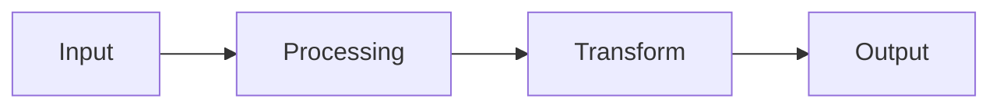

Please deep think / ultrathink as this is a complex task.

# plan-1a-explore

**Research and understand** how existing functionality works in the codebase. Perfect for arbitrary research questions or pre-planning exploration.

User input:
```
$ARGUMENTS
# Expected format:
# /plan-1a-explore "research query"  # Outputs research to console
# /plan-1a-explore --plan <name> "research query"  # Saves to plan folder
#
# Examples:
# /plan-1a-explore "research how the search service works"
# /plan-1a-explore --plan authentication-upgrade "research the current auth system"
```

## Purpose

Perform deep codebase research to understand how existing functionality works. Can be used for arbitrary research (outputs to console) or tied to a specific plan (saves to plan folder).

## Behavior

- **Without --plan**: Outputs research report directly to console for immediate use
- **With --plan**: Creates/uses plan folder and saves research as `research-dossier.md`

## Execution Flow

### 1) Parse Input

Extract research query and optional plan name:
- Parse $ARGUMENTS for --plan flag and research query
- If --plan provided:
  * Extract plan name (everything after --plan until research query)
  * Determine plan folder (see section 1a below)
  * Will save research to: `docs/plans/<ordinal>-<slug>/research-dossier.md`
- If no --plan:
  * Research will be output directly to console
  * No files created

### 1a) Plan Folder Management (when --plan provided)

```python
# Pseudo-code for plan folder handling
def determine_plan_folder(plan_name):
    # Check if plan_name is already a folder (e.g., "001-auth")
    if matches_pattern(r'^\d{3}-', plan_name):
        if exists(f"docs/plans/{plan_name}"):
            return f"docs/plans/{plan_name}"
        else:
            error(f"Plan folder {plan_name} does not exist")

    # plan_name is just a slug (e.g., "auth" or "authentication-upgrade")
    slug = slugify(plan_name)

    # Search for existing folder with this slug
    for folder in list_folders("docs/plans/"):
        if folder.endswith(f"-{slug}"):
            return f"docs/plans/{folder}"

    # No existing folder found - create new with next ordinal
    next_ordinal = get_next_ordinal()
    new_folder = f"docs/plans/{next_ordinal:03d}-{slug}"
    create_folder(new_folder)
    return new_folder
```

### 2) FlowSpace MCP Detection

**CRITICAL**: Check for FlowSpace MCP availability to leverage enhanced exploration

```python
# Pseudo-code for detection
try:
    # Try calling tree() with minimal params - fast and reliable
    flowspace.tree(pattern=".", max_depth=1)
    FLOWSPACE_AVAILABLE = True
    print("✅ FlowSpace MCP detected - using enhanced exploration")
except:
    FLOWSPACE_AVAILABLE = False
    print("ℹ️ FlowSpace not available - using standard tools")
    print("To install: uvx --from git+https://github.com/AI-Substrate/flow_squared fs2 install")
    print("Then run: fs2 init && fs2 scan (requires user configuration)")
    print("See: https://github.com/AI-Substrate/flow_squared/blob/main/README.md")
```

If FlowSpace is available, use these tools for enhanced exploration:
- `tree(pattern, max_depth, detail)` - Navigate codebase structure hierarchically
- `search(pattern, mode, limit, include, exclude)` - Find code by text, regex, or semantic meaning
- `get_node(node_id, detail)` - Retrieve full source code for a specific node

**Recommended workflow**:
1. Start with `tree(pattern=".", max_depth=1)` to see top-level structure
2. Use `search(pattern="concept", mode="semantic")` for conceptual discovery
3. Use `get_node(node_id)` to read full source after finding relevant nodes

### 2a) FlowSpace API Discovery (Runtime)

**IMPORTANT**: FlowSpace is actively developed. Before relying on static documentation, probe the API at runtime to discover current capabilities.

**Discovery steps**:
1. **Probe each FlowSpace tool** with minimal then maximal parameters
2. **Discover available features** - what fields, modes, and options exist?
3. **Check for new tools** - are there capabilities beyond tree/search/get_node?
4. **Note useful metadata** - AI summaries, language detection, relevance scores, etc.
5. **Use discovered capabilities** in the exploration that follows

This ensures agents always use the best available FlowSpace capabilities, even if this command was written before new features were added.

### 3) Launch Parallel Research Subagents

**IMPORTANT**: Use **parallel subagent execution** for comprehensive and efficient research.

**Strategy**: Launch 7 specialized subagents in a single message with 7 Task tool calls.

#### Subagent Prompts (FlowSpace Mode)

**Subagent 1: Implementation Archaeologist (FlowSpace)**
"Map the complete implementation landscape of [RESEARCH_TOPIC].

**If FlowSpace is available**: Use FlowSpace MCP tools:
- `tree(pattern="ClassName")` to find specific classes/functions
- `search(pattern="concept", mode="semantic")` for conceptual search
- `get_node(node_id)` to retrieve full source code

**Tasks**:
- Find all entry points (APIs, commands, event handlers)
- Trace execution flow using node relationships
- Document core algorithms and business logic
- Map data transformations with node IDs
- Identify configuration and initialization

**External Research Detection**:
Flag knowledge gaps that require external research when you encounter:
- Questions about current best practices (2024+) vs what code implements
- Industry standards, compliance, or security patterns not documented in code
- Performance optimization strategies beyond what's implemented
- Architectural decisions where "why" isn't clear from code
- Technology comparisons the codebase doesn't address
- Recent changes to libraries/frameworks the code depends on

For each gap found, note:
- Topic: [brief title]
- Why: [why code can't answer this]
- Context: [relevant code findings that led to this question]

**Output**: 8-10 findings numbered IA-01 through IA-10:
```markdown
### Finding IA-01: Main Entry Point
**Node ID**: method:src/search/service.py:SearchService.search
**Related Nodes**:
  - class:SearchService
  - function:src/search/utils.py:normalize_query
**Description**: [What this does]
**Code Example**: [Show actual code]
**Flow**: [How execution proceeds from here]
**External Research Gap** (if applicable): [Topic needing external research]
```

Return complete findings list including any external research gaps identified."

**Subagent 2: Dependency Cartographer (FlowSpace)**
"Create comprehensive dependency map for [RESEARCH_TOPIC].

**If FlowSpace is available**: Use FlowSpace MCP tools:
- `tree(pattern="ClassName")` to find specific classes/functions
- `search(pattern="concept", mode="semantic")` for conceptual search
- `get_node(node_id)` to retrieve full source code

**Tasks**:
- Map what [RESEARCH_TOPIC] depends on (imports, calls)
- Map what depends on [RESEARCH_TOPIC] (consumers)
- Document external service integrations
- Identify database/storage interactions
- Trace configuration dependencies

**External Research Detection**: (Same criteria as Subagent 1)

**Output**: 8-10 findings numbered DC-01 through DC-10 with dependency graphs, node IDs, and any external research gaps."

**Subagent 3: Pattern & Convention Scout (FlowSpace)**
"Identify design patterns and conventions in [RESEARCH_TOPIC].

**If FlowSpace is available**: Use FlowSpace MCP tools:
- `tree(pattern="ClassName")` to find specific classes/functions
- `search(pattern="concept", mode="semantic")` for conceptual search
- `get_node(node_id)` to retrieve full source code

**Tasks**:
- Design patterns used (Factory, Observer, Repository, etc.)
- Error handling approaches with examples
- Logging and monitoring strategies
- Naming conventions and code organization
- Architectural patterns (MVC, Clean, Hexagonal)

**External Research Detection**: (Same criteria as Subagent 1)

**Output**: 8-10 findings numbered PS-01 through PS-10 with pattern examples, node IDs, and any external research gaps."

**Subagent 4: Quality & Testing Investigator (FlowSpace)**
"Analyze quality and testing aspects of [RESEARCH_TOPIC].

**If FlowSpace is available**: Use FlowSpace MCP tools:
- `tree(pattern="ClassName")` to find specific classes/functions
- `search(pattern="concept", mode="semantic")` for conceptual search
- `get_node(node_id)` to retrieve full source code

**Tasks**:
- Current test coverage (unit, integration, e2e)
- Test strategies and patterns used
- Performance characteristics if documented
- Known bugs, limitations, tech debt
- Code quality indicators

**External Research Detection**: (Same criteria as Subagent 1)

**Output**: 8-10 findings numbered QT-01 through QT-10 with metrics, test references, and any external research gaps."

**Subagent 5: Interface & Contract Analyst (FlowSpace)**
"Document all interfaces and contracts for [RESEARCH_TOPIC].

**If FlowSpace is available**: Use FlowSpace MCP tools:
- `tree(pattern="ClassName")` to find specific classes/functions
- `search(pattern="concept", mode="semantic")` for conceptual search
- `get_node(node_id)` to retrieve full source code

**Tasks**:
- Public API signatures and endpoints
- Data schemas and validation rules
- Message/event contracts
- Integration protocols and formats
- Backward compatibility commitments

**External Research Detection**: (Same criteria as Subagent 1)

**Output**: 8-10 findings numbered IC-01 through IC-10 with contract details, node IDs, and any external research gaps."

**Subagent 6: Documentation & Evolution Historian (FlowSpace)**
"Gather documentation and historical context for [RESEARCH_TOPIC].

**If FlowSpace is available**: Use FlowSpace MCP tools:
- `tree(pattern="ClassName")` to find specific classes/functions
- `search(pattern="concept", mode="semantic")` for conceptual search
- `get_node(node_id)` to retrieve full source code

**Tasks**:
- Existing documentation (README, docs, wikis)
- Important code comments and design notes
- Related ADRs or design decisions
- Configuration documentation
- Migration and evolution history

**External Research Detection**: (Same criteria as Subagent 1)

**Output**: 8-10 findings numbered DE-01 through DE-10 with documentation references and any external research gaps."

**Subagent 7: Prior Learnings Scout (FlowSpace or Standard)**
"Search for prior discoveries and learnings that may be relevant to [RESEARCH_TOPIC].

**CRITICAL**: This subagent mines institutional knowledge from previous implementations. These learnings are gold - they capture gotchas, unexpected behaviors, workarounds, and insights that your future self left for you.

**If FlowSpace is available**: Use FlowSpace MCP to search for 'Discoveries & Learnings' sections and their contents.

**If FlowSpace unavailable**: Use standard tools:
- Grep for `## Discoveries & Learnings` in `docs/plans/`
- Read matching files to extract discovery tables
- Also search execution logs for patterns like `gotcha`, `unexpected`, `workaround`, `research-needed`

**Search Locations**:
1. `docs/plans/*/tasks/*/tasks.md` - Phase dossiers (Full Mode)
2. `docs/plans/*/*.md` - Plan files (Simple Mode may have inline discoveries)
3. `docs/plans/*/tasks/*/execution.log.md` - Execution logs with detailed context

**Tasks**:
- Find ALL `## Discoveries & Learnings` sections across prior plans
- Extract discoveries relevant to [RESEARCH_TOPIC]:
  * Match by keywords, technologies, patterns, file paths
  * Prioritize: `gotcha`, `unexpected-behavior`, `workaround`, `decision` types
- For each relevant discovery, capture:
  * Original discovery text
  * Resolution (how it was handled)
  * Source (which plan/phase it came from)
  * Why it might apply to current research
- Also scan execution logs for inline learnings (search for 'learned', 'discovered', 'gotcha', 'unexpected', 'note to self')

**Output**: 5-15 findings numbered PL-01 through PL-15:
```markdown
### Finding PL-01: [Discovery Title from Original]
**Source**: docs/plans/003-auth-upgrade/tasks/phase-2/tasks.md
**Original Type**: gotcha | unexpected-behavior | workaround | decision | debt | insight
**Original Task**: T007 - Implement token refresh
**Date Discovered**: 2024-01-15

**Original Discovery**:
> [Exact text from the discovery table]

**Original Resolution**:
> [How they resolved it]

**Relevance to Current Research**:
[Why this matters for [RESEARCH_TOPIC] - e.g., same API, similar pattern, related component]

**Actionable Insight**:
[What the current research/implementation should do with this knowledge]
```

**If no relevant prior learnings found**:
Report 'No prior learnings found related to [RESEARCH_TOPIC]' but still document:
- How many Discoveries & Learnings sections were scanned
- Topics covered by existing discoveries (for reference)
- Suggestion to check execution logs manually if topic is novel"

#### Subagent Prompts (Standard Mode - when FlowSpace unavailable)

**Subagent 1: Implementation Archaeologist (Standard)**
"Map the implementation landscape of [RESEARCH_TOPIC].

**Use standard tools**:
- Glob to find relevant files
- Grep to search for patterns
- Read to examine key files

**Tasks**:
- Find entry points by searching for route definitions, main functions
- Trace execution by reading core files
- Document algorithms by examining implementation
- Map data flow by following function calls

**External Research Detection**:
Flag knowledge gaps that require external research when you encounter:
- Questions about current best practices (2024+) vs what code implements
- Industry standards, compliance, or security patterns not documented in code
- Performance optimization strategies beyond what's implemented
- Architectural decisions where "why" isn't clear from code
- Technology comparisons the codebase doesn't address
- Recent changes to libraries/frameworks the code depends on

For each gap found, note:
- Topic: [brief title]
- Why: [why code can't answer this]
- Context: [relevant code findings that led to this question]

**Output**: 8-10 findings numbered IA-01 through IA-10 with file:line references and any external research gaps."

[Similar adaptations for other 5 subagents using Glob/Grep/Read instead of FlowSpace, all including External Research Detection]

**Subagent 7: Prior Learnings Scout (Standard)**
"Search for prior discoveries and learnings that may be relevant to [RESEARCH_TOPIC].

**CRITICAL**: This subagent mines institutional knowledge from previous implementations. These learnings are gold.

**Use standard tools**:
- Grep for `## Discoveries & Learnings` in `docs/plans/`
- Glob for `docs/plans/*/tasks/*/tasks.md` and `docs/plans/*/*.md`
- Read matching files to extract discovery tables
- Also Grep execution logs for 'gotcha', 'unexpected', 'workaround', 'learned', 'discovered'

**Search Locations**:
1. `docs/plans/*/tasks/*/tasks.md` - Phase dossiers
2. `docs/plans/*/*.md` - Plan files (Simple Mode)
3. `docs/plans/*/tasks/*/execution.log.md` - Execution logs

**Tasks**:
- Find ALL `## Discoveries & Learnings` sections
- Extract discoveries relevant to [RESEARCH_TOPIC] by keyword/technology/pattern matching
- Prioritize: `gotcha`, `unexpected-behavior`, `workaround`, `decision` types
- Capture original discovery, resolution, source, and relevance

**Output**: 5-15 findings numbered PL-01 through PL-15 with source references and actionable insights.

**If no relevant prior learnings found**: Report scan coverage and topics found (for reference)."

**Wait for All Subagents**: Block until all 7 subagents complete.

### 4) Synthesize Research Findings

After all subagents complete:

1. **Collect All Findings**: Gather ~55-75 findings from all 7 subagents (including Prior Learnings)
2. **Deduplicate**: Merge overlapping discoveries (note sources)
3. **Prioritize**: Order by impact (Critical → High → Medium → Low)
4. **Validate**: Ensure all findings have code references
5. **Surface Prior Learnings**: Highlight PL-## findings prominently - these are institutional knowledge that prevents repeating past mistakes
6. **Synthesize**: Create coherent narrative of how system works
7. **Identify External Research Opportunities**: Review all findings for:
   - Knowledge gaps flagged by subagents
   - Questions where code shows "what" but not "why this approach"
   - References to external standards/practices not documented
   - Technology decisions that may benefit from current best practices review

   For each opportunity, generate a ready-to-use `/deepresearch` prompt including:
   - Clear problem definition tied to codebase findings
   - Technology stack context from discovered code
   - Specific research questions
   - Integration considerations for this codebase

### 5) Generate Research Report

Create comprehensive research document with this structure:

```markdown
# Research Report: [RESEARCH_TOPIC]

**Generated**: [ISO-8601 timestamp]
**Research Query**: "[Original user input]"
**Mode**: [Research-Only | Pre-Plan | Plan-Associated]
**Location**: [Output path]
**FlowSpace**: [Available/Not Available]
**Findings**: [Total count]

## Executive Summary

### What It Does
[2-3 sentence high-level description of functionality]

### Business Purpose
[Why this exists in the system, what problem it solves]

### Key Insights
1. [Most important discovery]
2. [Second critical finding]
3. [Third key insight]

### Quick Stats
- **Components**: [N files, M classes]
- **Dependencies**: [X internal, Y external]
- **Test Coverage**: [Percentage or qualitative]
- **Complexity**: [High/Medium/Low assessment]
- **Prior Learnings**: [N relevant discoveries from previous implementations]

## How It Currently Works

### Entry Points
[Where execution begins - APIs, commands, events]

| Entry Point | Type | Location | Purpose |
|------------|------|----------|---------|
| [Name] | API/Command/Event | [Node ID or file:line] | [What triggers this] |

### Core Execution Flow
[Step-by-step explanation with code references]

1. **Step Name**: Description
   - Node/File: `[reference]`
   - What happens: [explanation]
   - Code snippet:
   ```[language]
   // Relevant code
   ```

2. [Continue for main flow]

### Data Flow

[Explain how data moves through the system]

### State Management
[How state is maintained, stored, synchronized]

## Architecture & Design

### Component Map
[Visual or textual representation of components]

#### Core Components
- **[Component Name]**: [Purpose and location]
  - Node ID: `[if FlowSpace]`
  - File: `[path]`
  - Responsibility: [what it does]

### Design Patterns Identified
1. **[Pattern Name]**: [Where used and why]
   - Example: [code showing pattern]
   - Benefits: [why this pattern here]

### System Boundaries
- **Internal Boundaries**: [Where this system ends]
- **External Interfaces**: [How it connects to outside]
- **Integration Points**: [Where other systems connect]

## Dependencies & Integration

### What This Depends On

#### Internal Dependencies
| Dependency | Type | Purpose | Risk if Changed |
|------------|------|---------|-----------------|
| [Module] | Required/Optional | [Why needed] | [Impact] |

#### External Dependencies
| Service/Library | Version | Purpose | Criticality |
|-----------------|---------|---------|-------------|
| [Name] | [Version] | [Why used] | High/Medium/Low |

### What Depends on This

#### Direct Consumers
- **[Consumer Name]**: [How it uses this]
  - Contract: [What it expects]
  - Breaking changes: [What would break it]

#### Indirect Consumers
[Systems that transitively depend on this]

### Integration Architecture
[How this fits into larger system]

## Quality & Testing

### Current Test Coverage
- **Unit Tests**: [Coverage and location]
- **Integration Tests**: [What's tested]
- **E2E Tests**: [End-to-end scenarios]
- **Gaps**: [What's not tested]

### Test Strategy Analysis
[Patterns and approaches used in testing]

### Known Issues & Technical Debt
| Issue | Severity | Location | Impact |
|-------|----------|----------|---------|
| [Description] | High/Medium/Low | [Where] | [What it affects] |

### Performance Characteristics
- **Response Time**: [Typical performance]
- **Resource Usage**: [Memory, CPU patterns]
- **Bottlenecks**: [Known slow points]
- **Scalability**: [Limits and considerations]

## Modification Considerations

### ✅ Safe to Modify
Areas with low risk of breaking changes:
1. **[Area]**: [Why it's safe]
   - Well tested
   - Clear boundaries
   - Few dependencies

### ⚠️ Modify with Caution
Areas requiring careful consideration:
1. **[Area]**: [Why it's risky]
   - Risk: [What could break]
   - Mitigation: [How to safely change]

### 🚫 Danger Zones
High-risk modification areas:
1. **[Area]**: [Why it's dangerous]
   - Dependencies: [What depends on this]
   - Alternative: [Safer approach]

### Extension Points
Designed for modification:
1. **[Extension Point]**: [How to extend]
   - Pattern: [Expected approach]
   - Example: [How others have extended]

## Prior Learnings (From Previous Implementations)

**IMPORTANT**: These are discoveries from previous work in this codebase. They represent institutional knowledge - gotchas, unexpected behaviors, and insights that past implementations uncovered. **Pay attention to these.**

[If no relevant prior learnings found:]
> No prior learnings found directly related to [RESEARCH_TOPIC].
> Scanned [N] Discoveries & Learnings sections across [M] plans.
> Existing discovery topics: [list for reference]

[If prior learnings found:]

### 📚 Prior Learning PL-01: [Title]
**Source**: [docs/plans/XXX/tasks/phase-N/tasks.md]
**Original Type**: [gotcha | unexpected-behavior | workaround | decision | debt | insight]
**Original Task**: [T### - Task name]
**Date**: [When discovered]

**What They Found**:
> [Original discovery text]

**How They Resolved It**:
> [Original resolution]

**Why This Matters Now**:
[Explanation of relevance to current research]

**Action for Current Work**:
[Specific recommendation based on this learning]

---

[Continue for all relevant prior learnings]

### Prior Learnings Summary

| ID | Type | Source Plan | Key Insight | Action |
|----|------|-------------|-------------|--------|
| PL-01 | [type] | [plan] | [one-liner] | [what to do] |
| PL-02 | [type] | [plan] | [one-liner] | [what to do] |

## Critical Discoveries

### 🚨 Critical Finding 01: [Title]
**Impact**: Critical
**Source**: [Which subagents found this]
**Node IDs**: [If FlowSpace available]
**What**: [Description]
**Why It Matters**: [Impact on any modifications]
**Required Action**: [What must be considered]

[Continue for all critical findings]

## Supporting Documentation

### Related Documentation
- [README files]: [Paths and relevance]
- [Design Docs]: [Links and summaries]
- [ADRs]: [Relevant architectural decisions]

### Key Code Comments
[Important inline documentation found]

### Historical Context
[Significant evolution insights from git history]

## Recommendations

### If Modifying This System
1. [First consideration]
2. [Second consideration]
3. [Third consideration]

### If Extending This System
1. [Recommended approach]
2. [Pattern to follow]
3. [What to avoid]

### If Refactoring This System
1. [Opportunity identified]
2. [Suggested improvement]
3. [Risk assessment]

## External Research Opportunities

During codebase exploration, the following knowledge gaps were identified that cannot be answered by reading more code. These require external research using tools like Perplexity Deep Research, ChatGPT, or similar.

[If no gaps identified: "No external research gaps identified during codebase exploration."]

### Research Opportunity 1: [Topic Title]

**Why Needed**: [1-2 sentences explaining what gap this fills]
**Impact on Plan**: [How this affects the upcoming work]
**Source Findings**: [Which subagent findings led to this - e.g., IA-03, DC-07]

**Ready-to-use prompt:**
```
/deepresearch "[Full structured prompt following deepresearch format:
- Clear problem definition tied to codebase findings
- Technology stack context
- Specific research questions
- Integration considerations]"
```

**Results location**: Save results to `docs/plans/<ordinal>-<slug>/external-research/[topic-slug].md`

### Research Opportunity 2: [Topic Title]
[Same structure...]

---

**After External Research:**
- To conduct external research: Run the `/deepresearch` commands above, then either:
  - Paste results back to this conversation, OR
  - Save to `external-research/` folder in the plan directory
- To skip and proceed: Run `/plan-1b-specify "[feature]"` (unresolved opportunities will be noted as a soft warning)

## Appendix: File Inventory

### Core Files
| File | Purpose | Lines | Last Modified |
|------|---------|-------|---------------|
| [Path] | [What it does] | [LOC] | [Date] |

### Test Files
[List of test files related to this functionality]

### Configuration Files
[Config files that affect this system]

## Next Steps

[Based on mode and external research opportunities]

**If External Research Opportunities identified:**
1. Run `/deepresearch` prompts above (copy-paste ready)
2. Save results to `external-research/` folder OR paste back to conversation
3. Then proceed to specification

**If no external research needed (or skipping):**
- Research-Only: Review findings and decide on action
- Pre-Plan: Run `/plan-1b-specify "[feature]"` to create specification
- Plan-Associated: Continue with plan phases

Note: Unresolved research opportunities will be flagged in `/plan-1b-specify` output.

---

**Research Complete**: [Timestamp]
**Report Location**: [Full path]
```

### 6) Output Research

**Without --plan**:
- Output the full research report directly to console
- No success message needed (the research IS the output)
- User can copy/paste or use immediately

**With --plan**:
```
✅ Research complete: docs/plans/[ordinal]-[slug]/research-dossier.md
- Plan folder: [Created new | Using existing]
- Components analyzed: [N] files
- Critical findings: [Count]
- Prior learnings surfaced: [Count] from previous implementations
- External research opportunities: [Count] identified
- FlowSpace mode: [Yes/No]

[If external research opportunities > 0:]
📚 External Research Suggested:
  1. [Topic 1] - run /deepresearch prompt in report
  2. [Topic 2] - run /deepresearch prompt in report
  Save results to: external-research/[topic-slug].md

- Next step (with research): Run /deepresearch prompts, then /plan-1b-specify
- Next step (skip research): Run /plan-1b-specify "[feature description]"
```

## CRITICAL: STOP AND WAIT

**THIS IS A READ-ONLY RESEARCH COMMAND.** After outputting the research report:

1. **DO NOT** proceed to `/plan-1b-specify` or any other command
2. **DO NOT** make any code changes or create additional files
3. **DO NOT** start implementing recommendations
4. **STOP** and wait for the user to provide instructions

The research is complete. The user will decide what to do next:
- Run `/deepresearch` for external knowledge gaps
- Run `/plan-1b-specify` to create a specification
- Ask follow-up questions
- Take a different action entirely

**Your job is done. Wait for user input.**

## Error Handling

### Common Errors
1. **No topic provided**: "Error: Please specify what to research"
2. **Plan not found**: "Error: Plan [ID] does not exist"
3. **Ambiguous topic**: "Warning: Topic too broad, please be specific"
4. **No relevant code found**: "Warning: Could not find code matching [topic]"

### Recovery Strategies
- If FlowSpace fails mid-research: Fallback to standard tools
- If subagent fails: Continue with other 5 and note gap
- If synthesis fails: Output raw findings

## Success Criteria

✅ **Answers the question**: "How does [X] currently work?"
✅ **Comprehensive**: Covers implementation, dependencies, patterns, quality
✅ **Actionable**: Identifies safe vs dangerous modifications
✅ **Well-referenced**: All findings have code locations
✅ **Tool-adaptive**: Uses FlowSpace when available, standard tools when not
✅ **Clear output**: Easy to understand research report
✅ **Integration-ready**: Works with or without planning workflow
✅ **Research gaps identified**: External research opportunities with ready-to-use /deepresearch prompts
✅ **Stops after output**: Does NOT proceed to other commands or actions without user instruction

## Integration with Other Commands

### With plan-1b-specify
- Checks for research-dossier.md in plan folder
- Checks for external-research/*.md files with /deepresearch results
- Incorporates findings into specification
- References critical discoveries
- Soft warning if external research opportunities were not addressed

### With plan-3-architect
- If research exists, reduces redundant discovery
- References research finding IDs
- Focuses on implementation planning

### With plan-2-clarify
- Can reference research to inform questions
- May trigger additional targeted research

## Examples

### Example 1: Quick Research (Console Output)
```bash
/plan-1a-explore "research how the search service works"
```
Outputs research directly to console. No files created.

### Example 2: Research for New Plan
```bash
/plan-1a-explore --plan authentication-upgrade "research the current auth system"
```
Creates `docs/plans/001-authentication-upgrade/research-dossier.md`

### Example 3: Research for Existing Plan (by slug)
```bash
/plan-1a-explore --plan search-improvement "research search indexing strategy"
```
If `002-search-improvement` exists, saves there. Otherwise creates new folder.

### Example 4: Research for Existing Plan (by full name)
```bash
/plan-1a-explore --plan 003-payment-refactor "deep dive on payment processing"
```
Saves to `docs/plans/003-payment-refactor/research-dossier.md`

This command provides deep, actionable research into existing codebase functionality, filling the critical gap between needing to change something and understanding how it currently works. It adapts to available tools (FlowSpace or standard) and integrates seamlessly with the planning workflow when desired.