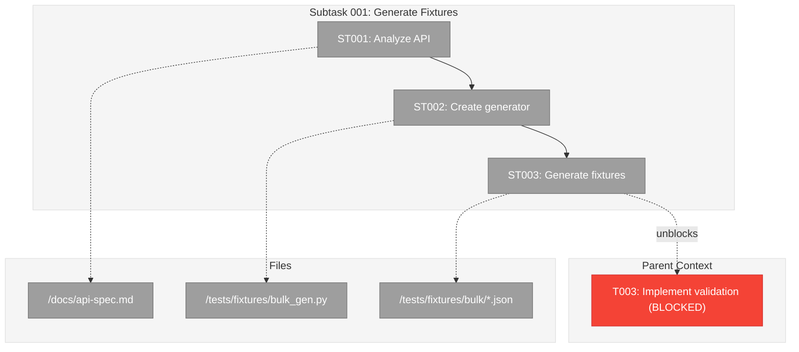

Please deep think / ultrathink as this is a nuanced extension of plan-5 outputs.

# plan-5a-subtask-tasks-and-brief

## Executive Briefing

**What this command does**: Creates a focused subtask dossier when mid-phase work needs its own structured planning—without creating a new phase or modifying the main plan.

**When to use**: During phase implementation when you discover a task needs deeper breakdown, or when a blocker requires separate tracked work that feeds back into the parent phase.

### Input → Output

```
INPUT:
  --plan "/abs/path/docs/plans/3-feature-x/feature-x-plan.md"
  --phase "Phase 2: Core Implementation"        # optional if only one active phase
  "Generate integration fixtures for bulk API"  # positional: subtask summary

OUTPUT:
  docs/plans/3-feature-x/tasks/phase-2-core-implementation/001-subtask-generate-integration-fixtures.md

  + Updates parent tasks.md (links subtask in Subtasks column)
  + Updates plan.md (adds entry to Subtasks Registry)
```

### Sample Output Structure

```markdown
# Subtask 001: Generate Integration Fixtures for Bulk API

**Parent Plan:** [feature-x-plan.md](../../feature-x-plan.md)
**Parent Phase:** Phase 2: Core Implementation
**Parent Task(s):** [T003: Implement validation](../tasks.md#task-t003)
**Created:** 2024-01-15

## Parent Context

**Why This Subtask:**
T003 blocked—need realistic test fixtures before validation logic can be tested.

---

## Executive Briefing

### Purpose
This subtask creates realistic test fixtures for the bulk import API so that
T003 (validation implementation) can be tested against production-like data.

### What We're Building
A fixture generator that produces:
- 50 valid bulk import JSON payloads with realistic field values
- 10 edge-case payloads (empty arrays, oversized batches, malformed records)
- Schema validation helpers for fixture integrity checks

### Unblocks
- T003: Implement validation logic (currently blocked on missing test data)

### Example
**Generated fixture** (`tests/fixtures/bulk/valid_001.json`):
```json
{
  "items": [{"id": 1, "name": "Widget A", "price": 29.99}, ...],
  "metadata": {"source": "test", "generated": "2024-01-15"}
}
```

---

## Objectives & Scope

### Objective
Generate realistic test fixtures so T003 (validation implementation) can be tested against production-like data.

### Goals

- ✅ Analyze bulk API response structure
- ✅ Create reusable fixture generator
- ✅ Generate 50 valid + 10 edge-case fixtures
- ✅ Unblock T003 validation work

### Non-Goals

- ❌ Production data migration (out of scope)
- ❌ Performance benchmarking of fixtures (not needed)
- ❌ Fixture versioning system (overkill for this subtask)

---

## Architecture Map

### Component Diagram
<!-- Status: grey=pending, orange=in-progress, green=completed, red=blocked -->
<!-- Updated by plan-6 during implementation -->



### Task-to-Component Mapping

<!-- Status: ⬜ Pending | 🟧 In Progress | ✅ Complete | 🔴 Blocked -->

| Task | Component(s) | Files | Status | Comment |
|------|-------------|-------|--------|---------|
| ST001 | API Analysis | /docs/api-spec.md | ⬜ Pending | Understand existing patterns before modifying |
| ST002 | Generator | /tests/fixtures/bulk_gen.py | ⬜ Pending | Create fixture generation tool |
| ST003 | Fixtures | /tests/fixtures/bulk/*.json | ⬜ Pending | Generate test data files |

---

## Tasks

| Status | ID    | Task                          | CS | Type  | Dependencies | Absolute Path(s)                    | Validation              | Subtasks | Notes           |
|--------|-------|-------------------------------|----|----- -|--------------|-------------------------------------|-------------------------|----------|-----------------|
| [ ]    | ST001 | Analyze bulk API response     | 1  | Setup | –            | /abs/path/docs/api-spec.md          | Structure documented    | –        | Supports T003   |
| [ ]    | ST002 | Create fixture generator      | 2  | Core  | ST001        | /abs/path/tests/fixtures/bulk_gen.py| Generates valid JSON    | –        | –               |
| [ ]    | ST003 | Generate 50 test fixtures     | 1  | Core  | ST002        | /abs/path/tests/fixtures/bulk/*.json| Files exist, valid      | –        | –               |

## Alignment Brief
...

## Discoveries & Learnings

_Populated during implementation by plan-6. Log anything of interest to your future self._

| Date | Task | Type | Discovery | Resolution | References |
|------|------|------|-----------|------------|------------|
| | | | | | |

**Types**: `gotcha` | `research-needed` | `unexpected-behavior` | `workaround` | `decision` | `debt` | `insight`
```

### When to Use Subtasks vs New Phase

| Scenario                                    | Use Subtask (5a) | Use New Phase (plan-3) |
|---------------------------------------------|------------------|------------------------|
| Task blocked, needs focused breakdown       | ✅               | ❌                     |
| Work stays within current phase scope       | ✅               | ❌                     |
| Adds new acceptance criteria                | ❌               | ✅                     |
| Requires architectural changes              | ❌               | ✅                     |
| Multiple team members need coordination     | ❌               | ✅                     |

---

Generate an actionable **subtask dossier** alongside the parent phase's `tasks.md`. Use this when a request needs structured planning but stays within an approved phase. Produce a self-contained markdown file named `PHASE_DIR/<ordinal>-subtask-<slug>.md` and stop before any implementation.

---

## 📝 CRITICAL REQUIREMENT: LOG DISCOVERIES & LEARNINGS

**During implementation, you MUST log discoveries to TWO places:**

1. **Execution Log** (`execution.log.md`) — Detailed narrative of what happened
2. **Discoveries Table** (bottom of subtask dossier) — Structured, searchable record

**What to log** (anything of interest to your future self):
- 🔴 Things that **didn't work as expected**
- 🔍 External **research that was required** (and what you learned)
- 🛠️ Implementation **troubles and how they were resolved**
- ⚠️ **Gotchas and edge cases** discovered
- 🎯 **Decisions made** during implementation (and why)
- 💳 **Technical debt introduced** (and justification)
- 💡 **Insights** that future phases should know about

**Why this matters**: Powerful tooling can surface these discoveries later. Your future self (and teammates) will thank you.

---

## 🚫 CRITICAL PROHIBITION: NO TIME ESTIMATES

**NEVER** output time or duration estimates in **ANY FORM**:
- ❌ Hours, minutes, days, weeks, months
- ❌ "Quick", "fast", "soon", "trivial duration"
- ❌ "ETA", "deadline", "timeline"
- ❌ "~4 hours", "2-3 days", "should take X time"
- ❌ "Total Estimated Effort: X hours/days"

**ONLY** use **Complexity Score (CS 1-5)** from constitution rubric:
- ✅ CS-1 (trivial): 0-2 complexity points
- ✅ CS-2 (small): 3-4 complexity points
- ✅ CS-3 (medium): 5-7 complexity points
- ✅ CS-4 (large): 8-9 complexity points
- ✅ CS-5 (epic): 10-12 complexity points

**Rubric factors** (each scored 0-2): Scope, Interconnections, Dependencies, Novelty, Fragility, Testing
Reference: `docs/project-rules/constitution.md` § 9

**Before outputting subtask dossier, validate**: No time language present? All subtask estimates use CS 1-5 only?

---

```md
User input:

$ARGUMENTS
# Required flag:
# --plan "<abs path to docs/plans/<ordinal>-<slug>/<slug>-plan.md>"
# Optional flags:
# --phase "<Phase N: Title>"      # infer if omitted (see below)
# --ordinal "NNN"                 # override next subtask ordinal when you must align with pre-created shells
# Trailing argument (positional):  # summary/title for this subtask request
#   e.g., "Generate integration fixtures for bulk import API"

1) Resolve paths & derive identifiers:
   - PLAN      = provided --plan; abort if missing.
   - PLAN_DIR  = dirname(PLAN).
   - If --phase supplied, match exact heading within PLAN; else infer:
     * scan PLAN_DIR/tasks/* for `tasks.md`; if exactly one `phase-*` contains the most recent GO, adopt it.
     * if multiple phases are eligible, stop and request explicit `--phase`.
   - PHASE_SLUG from phase heading (same slug plan-5 uses).
   - PHASE_DIR = PLAN_DIR/tasks/${PHASE_SLUG}; ensure exists (mkdir -p allowed here).
   - SUBTASK_SUMMARY = trailing argument trimmed; err if empty.
   - SUBTASK_SLUG = kebab-case summary (`[^a-z0-9-]` → '-', collapse dups, trim dash).
   - Determine ordinal:
     * Existing files matching `${PHASE_DIR}/[0-9][0-9][0-9]-subtask-*.md` → take highest NNN.
     * ORD = --ordinal if provided else highest+1 (zero-pad to 3 digits; start at `001`).
   - SUBTASK_FILE = `${PHASE_DIR}/${ORD}-subtask-${SUBTASK_SLUG}.md`.
   - SUBTASK_LOG  = `${PHASE_DIR}/${ORD}-subtask-${SUBTASK_SLUG}.execution.log.md`.

2) Parse parent context:
   - Load PLAN to review:
     * `## 3. Critical Research Findings` (as in plan-5 step 2).
     * The chosen phase heading and its task table (plan-3 output).
     * Any Ready/GO markers or guardrails relevant to subtasks.
   - Load `PHASE_DIR/tasks.md` (if missing, abort; subtask requires existing phase dossier).
   - Collect parent dossier metadata: objective, invariants, diagrams, ready check, etc. Note references to reuse or narrow scope.

3) Define subtask linkage:
   - Identify which parent task(s) (T001… from phase dossier) the subtask supports. Capture IDs and plan-table coordinates (e.g., phase task `2.3`).
   - Confirm subtask scope stays within existing phase acceptance criteria; if not, halt.

4) Content expectations for `${SUBTASK_FILE}` (mirror plan-5 layout, scoped to subtask):
   - Front matter: title = `Subtask <ORD>: <Summary>`; include parent phase + plan links; record today as {{TODAY}}.
   - `## Parent Context` section with rich linkage back to parent:
     ```markdown
     ## Parent Context

     **Parent Plan:** [View Plan](../../<plan-filename>)
     **Parent Phase:** <Phase N: Title>
     **Parent Task(s):** [T<XXX>: <task summary>](../tasks.md#task-t<xxx>)
     **Plan Task Reference:** [Task <N.M> in Plan](../../<plan-filename>#<plan-task-anchor>)

     **Why This Subtask:**
     <Reason this subtask was created - captured from user input/arguments>

     **Created:** {{TODAY}}
     **Requested By:** <user or "Development Team">

     ---
     ```
     Replace `<placeholders>` with actual values derived from PLAN, PHASE_HEADING, and parent task linkage identified in step 3.
   - `## Executive Briefing` section that explains **what this subtask will accomplish and why** in human-readable form. This is NOT about how the dossier was generated—it's about the actual work. Include:
     * **Purpose**: 2-3 sentence summary of what this subtask delivers and why it matters
     * **What We're Building**: Concrete description of the component/fixture/capability being added
     * **Unblocks**: What parent task(s) this enables
     * **Example** (when applicable): A before/after or input/output example

     Example Executive Briefing:
     ```markdown
     ## Executive Briefing

     ### Purpose
     This subtask creates realistic test fixtures for the bulk import API so that
     T003 (validation implementation) can be tested against production-like data.

     ### What We're Building
     A fixture generator that produces:
     - 50 valid bulk import JSON payloads
     - 10 edge-case payloads (empty, oversized, malformed)
     - Schema validation helpers

     ### Unblocks
     - T003: Implement validation logic (currently blocked on missing test data)

     ### Example
     **Generated fixture**: `tests/fixtures/bulk/valid_001.json`
     ```json
     { "items": [...50 records...], "metadata": { "source": "test" } }
     ```
     ```
   - `## Objectives & Scope` section (same structure as plan-5) that sets clear boundaries for the subtask:
     * **Objective**: Recap what this subtask will accomplish, tied to unblocking the parent task
     * **Goals**: Bullet list of what this subtask WILL deliver (✅ prefix)
     * **Non-Goals**: What this subtask is NOT doing (❌ prefix) - prevents scope creep

     Example:
     ```markdown
     ## Objectives & Scope

     ### Objective
     Generate realistic test fixtures so T003 can be tested against production-like data.

     ### Goals

     - ✅ Analyze bulk API response structure
     - ✅ Create reusable fixture generator
     - ✅ Generate 50 valid + 10 edge-case fixtures

     ### Non-Goals

     - ❌ Production data migration (out of scope)
     - ❌ Performance benchmarking (not needed)
     ```

   - `## Architecture Map` section showing the scoped system architecture for this subtask:
     * Shows relationship between subtask work and parent task(s)
     * Uses ST### node IDs for subtask tasks
     * Includes parent task node(s) in "Parent Context" subgraph
     * Shows "unblocks" edge from final subtask to parent task
     * ALL nodes start as `:::pending` (grey) — plan-6 updates colors during execution
     * Uses same color classes as plan-5: pending (grey), inprogress (orange), completed (green), blocked (red)

     Example structure:
     ```markdown
     ## Architecture Map

     ### Component Diagram
     <!-- Updated by plan-6 during implementation -->

     ```mermaid
     flowchart TD
         classDef pending fill:#9E9E9E,stroke:#757575,color:#fff
         classDef inprogress fill:#FF9800,stroke:#F57C00,color:#fff
         classDef completed fill:#4CAF50,stroke:#388E3C,color:#fff
         classDef blocked fill:#F44336,stroke:#D32F2F,color:#fff

         style Parent fill:#F5F5F5,stroke:#E0E0E0
         style Subtask fill:#F5F5F5,stroke:#E0E0E0
         style Files fill:#F5F5F5,stroke:#E0E0E0

         subgraph Parent["Parent Context"]
             T003["T003: Implement validation (BLOCKED)"]:::blocked
         end

         subgraph Subtask["Subtask: [Summary]"]
             ST001["ST001: [Task]"]:::pending
             ST002["ST002: [Task]"]:::pending
             ST003["ST003: [Task]"]:::pending

             ST001 --> ST002 --> ST003
         end

         subgraph Files["Files"]
             F1["[file1]"]:::pending
             F2["[file2]"]:::pending
         end

         ST001 -.-> F1
         ST002 -.-> F2
         ST003 -.->|unblocks| T003
     ```

     ### Task-to-Component Mapping

     <!-- Status: ⬜ Pending | 🟧 In Progress | ✅ Complete | 🔴 Blocked -->

     | Task | Component(s) | Files | Status | Comment |
     |------|-------------|-------|--------|---------|
     | ST001 | ... | ... | ⬜ Pending | [one-liner about what this task does] |
     ```

   - `## Tasks` table using canonical columns
     | Status | ID | Task | CS | Type | Dependencies | Absolute Path(s) | Validation | Subtasks | Notes |
     * Use IDs `ST001`, `ST002`, … (serial, reflect mapping to parent T-ID in Notes like "Supports T003 (footnote captured during plan-6)").
     * `CS` (Complexity Score 1-5) is required for each subtask using constitution rubric (CS-1=trivial, CS-2=small, CS-3=medium, CS-4=large, CS-5=epic). Score each subtask using S,I,D,N,F,T factors (0-2 each).
     * Dependencies reference other ST IDs (and optionally parent T-IDs in Notes).
     * Absolute paths remain mandatory (absolute); include parent dossier paths if reused.
     * `Subtasks` column is always "–" for subtask dossiers (no recursive sub-subtasking).
     * Notes capture context (e.g., parent T-ID, Critical Finding refs) without adding `[^N]` footnote tags; plan-6 will append ledger references after implementation.
   - `## Alignment Brief` tailored to the subtask:
     * Objective recap referencing parent phase goal + targeted parent tasks.
     * Checklist derived from parent acceptance criteria, highlighting deltas introduced by this subtask.
     * **Critical Findings Affecting This Subtask**: cite relevant discoveries (same structure as plan-5).
     * **ADR Decision Constraints** (if ADRs exist):
       - List each relevant ADR: `ADR-NNNN: [Title] – [Decision one-liner]`
       - Note specific constraints from the ADR that affect this subtask
       - Map constraints to specific subtasks: "Constrains: [items]; Addressed by: [ST00X, ST00Y]"
       - Tag affected subtask rows in the Notes column with "Per ADR-NNNN"
     * Invariants/guardrails inherited from parent + any new subtasks constraints.
     * Inputs to read (files, specs, existing artifacts).
     * Visual aids: at least one Mermaid flow diagram + one sequence diagram focusing on this subtask slice; condense actors to keep clarity while aligning with parent diagrams.
     * Test Plan: enumerate tests specific to this subtask (TDD vs lightweight align with parent instructions).
     * Implementation outline: map steps 1:1 to ST tasks + tests.
     * Commands to run, focused on this subtask (linters/tests/etc.).
     * Risks & unknowns with mitigations.
     * Ready Check (checkbox list) gating `/plan-6-implement-phase` or `/plan-6-implement-phase --subtask` usage.
   - `## Phase Footnote Stubs` section present as an empty table shell or note so plan-6 can add entries later; do not create footnote tags during planning.
   - `## Evidence Artifacts` describing:
     * `execution.log.md` path = `${ORD}-subtask-${SUBTASK_SLUG}.execution.log.md`.
     * Any directories/files for artifacts (tests, fixtures, diagrams exports, etc.).
   - `## Discoveries & Learnings` section with empty table shell for plan-6 to populate during implementation. This captures gotchas, research, unexpected behaviors, decisions, and insights for future reference. Include the following structure:

     ```markdown
     ## Discoveries & Learnings

     _Populated during implementation by plan-6. Log anything of interest to your future self._

     | Date | Task | Type | Discovery | Resolution | References |
     |------|------|------|-----------|------------|------------|
     | | | | | | |

     **Types**: `gotcha` | `research-needed` | `unexpected-behavior` | `workaround` | `decision` | `debt` | `insight`

     **What to log**:
     - Things that didn't work as expected
     - External research that was required
     - Implementation troubles and how they were resolved
     - Gotchas and edge cases discovered
     - Decisions made during implementation
     - Technical debt introduced (and why)
     - Insights that future phases should know about

     _See also: `execution.log.md` for detailed narrative._
     ```

   - `## After Subtask Completion` section providing resumption guidance:
     ```markdown
     ## After Subtask Completion

     **This subtask resolves a blocker for:**
     - Parent Task: [T<XXX>: <summary>](../tasks.md#task-t<xxx>)
     - Plan Task: [<N.M>: <summary>](../../<plan-filename>#<task-anchor>)

     **When all ST### tasks complete:**

     1. **Record completion** in parent execution log:
        ```
        ### Subtask <SUBTASK_KEY> Complete

        Resolved: <brief summary of what was fixed>
        See detailed log: [subtask execution log](./<SUBTASK_KEY>.execution.log.md)
        ```

     2. **Update parent task** (if it was blocked):
        - Open: [`tasks.md`](../tasks.md)
        - Find: T<XXX>
        - Update Status: `[!]` → `[ ]` (unblock)
        - Update Notes: Add "Subtask <SUBTASK_KEY> complete"

     3. **Resume parent phase work:**
        ```bash
        /plan-6-implement-phase --phase "<PHASE_HEADING>" \
          --plan "<PLAN_ABSOLUTE_PATH>"
        ```
        (Note: NO `--subtask` flag to resume main phase)

     **Quick Links:**
     - 📋 [Parent Dossier](../tasks.md)
     - 📄 [Parent Plan](../../<plan-filename>)
     - 📊 [Parent Execution Log](../execution.log.md)
     ```
     Replace `<placeholders>` with actual values; SUBTASK_KEY = `${ORD}-subtask-${SUBTASK_SLUG}`.
   - Trailing directory sketch showing `PHASE_DIR` contents including subtask file + execution log (note that plan-6 writes the log, plan-6a updates both plan + subtask).

5) Safeguards & consistency:
   - Do **not** duplicate tasks already captured in `tasks.md`; instead refine them into ST tasks or note shared dependencies.
   - Respect BridgeContext patterns, repo rules, and mock preferences identical to plan-5 (cite `docs/project-rules/*`).
   - Ensure Notes column captures contextual references (parent T-IDs, Critical Finding refs) for traceability.
   - Ensure the Ready Check and commands reference invoking `/plan-6-implement-phase` with `--subtask ${ORD}-subtask-${SUBTASK_SLUG}`.
   - Do **not** touch code or update logs; stop after writing `${SUBTASK_FILE}`.

6) Output:
   - Write `${SUBTASK_FILE}` using ASCII; maintain markdown table alignment.
   - If `${SUBTASK_LOG}` already exists (prior runs), leave untouched but mention it in Evidence Artifacts; otherwise note that plan-6 will create it.
   - Provide a concise summary of parent linkage at the end (e.g., "Supports T003 in Phase 4").

7) Register subtask in plan's Subtasks Registry:
   - Read PLAN and check for section `## Subtasks Registry`.
   - If section doesn't exist, append to bottom of PLAN:
     ```markdown
     ## Subtasks Registry

     Mid-implementation detours requiring structured tracking.

     | ID | Created | Phase | Parent Task | Reason | Status | Dossier |
     |----|---------|-------|-------------|--------|--------|---------|
     ```
   - Append new row to the table:
     ```markdown
     | ${ORD}-subtask-${SUBTASK_SLUG} | {{TODAY}} | ${PHASE_HEADING} | T${XXX} | <reason from user input> | [ ] Pending | [Link](tasks/${PHASE_SLUG}/${ORD}-subtask-${SUBTASK_SLUG}.md) |
     ```
   - The "reason" should match the "Why This Subtask" captured in Parent Context section.
   - Status starts as `[ ] Pending`; plan-6 will update to `[x] Complete` when all ST### tasks finish.

8) Update parent task's Subtasks column (bidirectional link):
   - Open parent dossier: `${PHASE_DIR}/tasks.md`
   - Locate parent task row (T${XXX}) in the tasks table
   - Update the `Subtasks` column:
     * If column currently shows "–" (no subtasks), replace with: `${ORD}-subtask-${SUBTASK_SLUG}`
     * If column already has subtasks (comma-separated list), append: `, ${ORD}-subtask-${SUBTASK_SLUG}`
   - Example transformation:
     ```markdown
     Before:
     | [~] | T003 | Implement validation | Core | T001 | /abs/path | Tests pass | – | Supports plan task 2.3 |

     After:
     | [~] | T003 | Implement validation | Core | T001 | /abs/path | Tests pass | 001-subtask-fixtures | Supports plan task 2.3 |
     ```
   - This enables bidirectional graph traversal: parent task → subtasks AND subtask → parent task

STOP once the subtask dossier is generated, registry is updated, and parent task is linked. Await human GO before implementation.
```

Why this exists: Subtasks add structured planning for mid-phase branches without exploding the main dossier. They inherit critical context while allowing fine-grained execution tracking.
